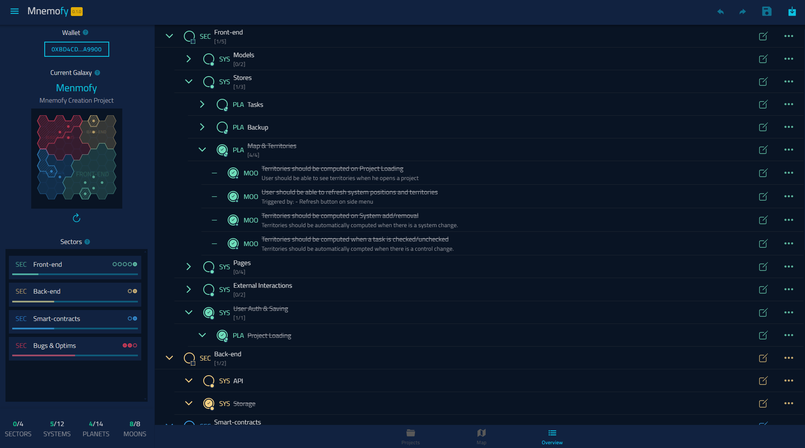
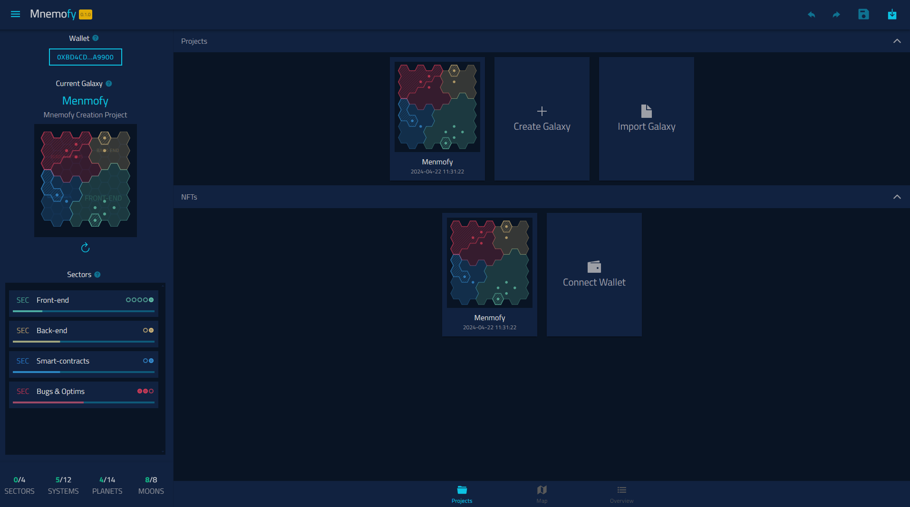
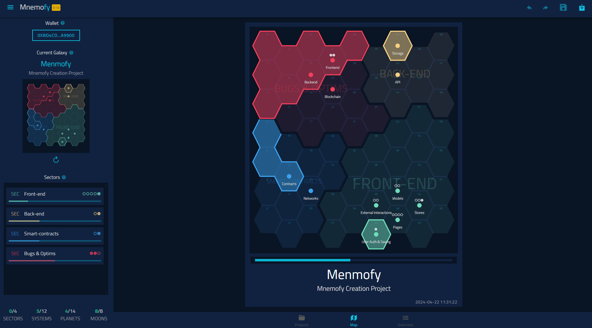
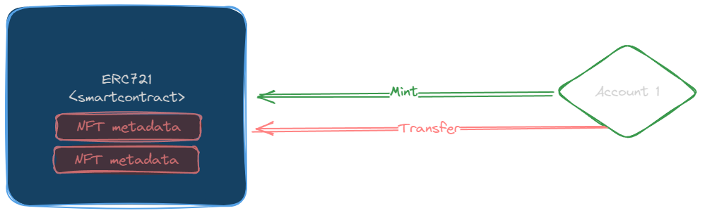
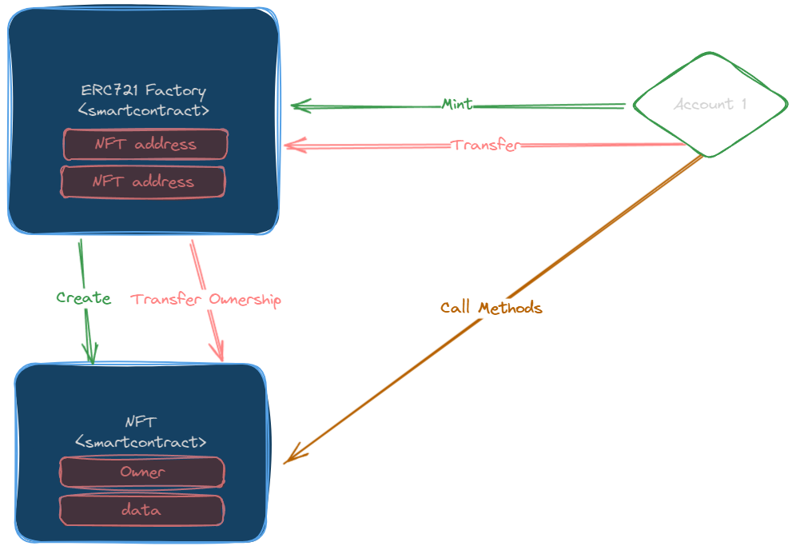

# [Mnemofy] Scaling NFTs: A Glorified Progress bar as a Space Map

**TLDR**: Menmofy is basically a todo app that allows you to follow the progress of your project as a space map with territories representing your progress. These maps can be minted as NFTs. However, these are not simple NFTs, they are smart contracts themselfs, allowing you to have a detailed view on you project and to create snapshots of your progress.

This is a project submission for the encode Web3 Scaling Hackathon.

## Links

- [Demo Video]()
- [Pitch Deck](https://docs.google.com/presentation/d/1xWOztCVvaGYTs0r7JGUa9iVoH9-RUQpqX-j9Oyo_X2E/edit?usp=sharing)
- [Etherlink Mnemofy Factory]()

## Table of Content

- [How it works](#how-it-works)
- [Known Issues](#known-issues)
- [Roadmap](#roadmap)

## How it works

### General NFT Scaling Idea

NFTs are generally implemented using the `ERC721` standard, they are represented as some metadata (link to an image, a list of attributes, etc.). Given the emergence of blockchains with cheap fees, a new paradigm can be added to the way NFTs are stored and interacted with on chain.

In this project, NFTs are themselves smart-contracts. This allows for a large array of use cases. However, in order for this idea to work, the concept of `ownership` needs to be redefined: **Owning an NFT = Owning the underlying smart-contract**.

When an NFT is miting, a smart contract is created with the owner being the minter. When an NFT is sold or transferred, the ownership of the underlying smart-contract is also transferred.

### Mnemofy: Glorified Progress Bar as a Space Map

Mnemofy is a simple todo app that displays the progress as a space map with territories, the more todos you finish the bigger the territory you control. You can then generate a smart-contract NFT representing your todo project. As you advance in completing your project, you can create snapshots of your progress. You can then view your progress through the snapshots in the NFT smart-contract.

The resulting NFT functions the same way as any ERC721 NFT, the added value is that now you can have snapshots inside these NFTs!

## Known Issues

## Roadmap
